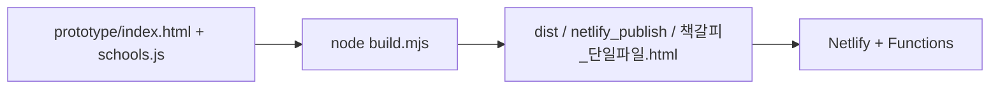
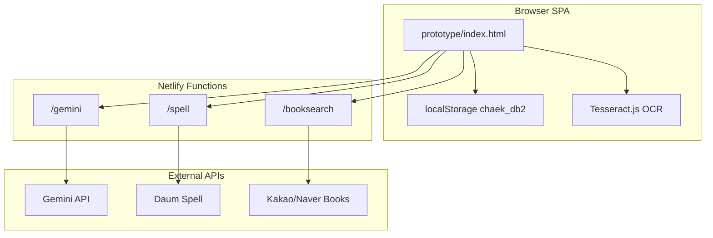
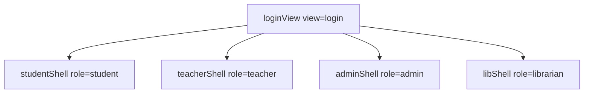
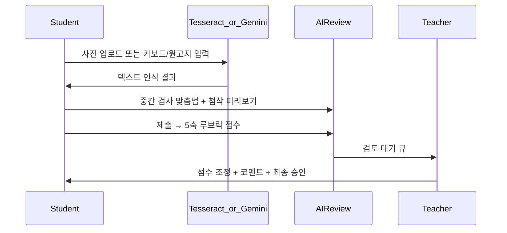

# 「책갈피」 프로젝트 분석 보고서

> 코드베이스 기준 구조·기술·화면·기능 종합 분석  
> 작성일: 2026-07-04 · 프로토타입 v0.7 · 소스 [`prototype/index.html`](../prototype/index.html) (약 2,354줄)

---

## 1. 프로젝트 개요

### 1.1 목적

**책갈피**는 제20회 디지털교육연구대회(교육용 SW·AI분과) 출품용 **초등 독서활동 종합 플랫폼**이다. 손글씨 독후감을 OCR로 디지털화하고, AI가 **내용·사고력** 중심의 5축 루브릭으로 발전적 첨삭을 제공하며, 교사가 Human-in-the-Loop 방식으로 검토·확정한다. 포인트·아바타·랭킹 등 게이미피케이션으로 읽기 동기를 부여한다.

### 1.2 핵심 수치

| 항목 | 내용 |
|------|------|
| 프로덕션 URL | https://chaekgalpi.netlify.app |
| 메인 소스 | `prototype/index.html` (약 274KB) |
| 아키텍처 | 단일 HTML + 바닐라 JavaScript SPA |
| 데이터 저장 | 브라우저 `localStorage` (`chaek_db2`, `DB_VERSION=3`) |
| 지원 학교 | 전국 초등학교 6,331곳 (NEIS, `schools.js`) |
| 권장도서 | 44권 (`BOOKS` 상수) |
| 사용자 역할 | 4계층 (학생·담임·교무관리자·도서관 담당) |

### 1.3 기존 도구와의 차별 (요약)

| 구분 | 기존 도구 | 책갈피 |
|------|-----------|--------|
| 평가 대상 | 맞춤법·표현 위주 | **5축**(내용·감상·삶 연결·구성·맞춤법) |
| 평가 체계 | 단순 교정 | **2022 개정 성취수준(A/B/C) + 성취기준 코드** |
| 교사 역할 | 전량 수기 첨삭 | **AI 초안 → 교사 조정·확정** |
| 손글씨 | 미지원 | **Tesseract.js / Gemini Vision OCR** |
| 동기 부여 | 약함 | 포인트·성장단계·아바타·3단 랭킹·명예의 전당 |

> 상세 배경·전략은 [`09_개발보고서.md`](09_개발보고서.md), [`01_연구분석_종합.md`](01_연구분석_종합.md) 참조.

---

## 2. 기술 스택 및 아키텍처

### 2.1 사용하지 않는 기술 (명시)

본 프로젝트는 React, Next.js, Vue, Svelte, TypeScript, Vite, Webpack 등 **모던 프론트엔드 프레임워크를 사용하지 않는다.** 루트에 `package.json`이 없으며, npm 의존성 관리·번들러·타입 체커가 없다.

### 2.2 사용 언어

| 언어 | 용도 | 대표 파일 |
|------|------|-----------|
| **HTML5** | 앱 UI, 배포 산출물 | `prototype/index.html`, `dist/index.html`, `netlify_publish/index.html` |
| **CSS3** | 인라인 `<style>` (별도 `.css` 파일 없음) | `prototype/index.html` |
| **JavaScript (Vanilla)** | 전체 앱 로직, Netlify Functions, AI 프록시 | `prototype/index.html`, `netlify/functions/*.js`, `prototype/deploy/*.js` |
| **Python 3** | NEIS Open API로 학교 데이터 생성 | `prototype/tools/fetch_schools_full.py` |
| **Markdown** | 설계·연구·배포 문서 | `연구/*.md`, `README.md`, `dist/배포_가이드.md` |

### 2.3 프론트엔드 라이브러리·API (CDN·브라우저 내장)

| 기술 | 버전/형태 | 역할 |
|------|-----------|------|
| **Pretendard** | jsDelivr CDN | 한글 UI 폰트 |
| **Tesseract.js** | v5 (jsDelivr) | 브라우저 OCR 폴백 (`kor` 언어팩) |
| **Web Speech API** | 브라우저 내장 | STT(음성 입력), TTS(읽어주기) |
| **Canvas API** | 브라우저 내장 | OCR 전처리(`preprocessForOCR`), 성장 카드 PNG |
| **MediaRecorder** | 브라우저 내장 | 낭독 녹음 첨부 |
| **SVG (인라인)** | 자체 구현 | 5축 방사형 그래프(`radarSVG`), 아바타 레이어 합성 |
| **window.print()** | 브라우저 내장 | PDF/인쇄 (jsPDF 등 별도 라이브러리 없음) |

### 2.4 백엔드 — 서버리스 API 프록시

클라이언트는 외부 API를 직접 호출하지 않고, **CORS 우회·API 키 보호**를 위해 서버리스 함수를 경유한다.

| 엔드포인트 | 파일 | 메서드 | 외부 API | 환경변수 |
|------------|------|--------|----------|----------|
| `/.netlify/functions/gemini` | `netlify/functions/gemini.js` | POST | Google Gemini 2.5 Flash | `GEMINI_API_KEY` |
| `/.netlify/functions/spell` | `netlify/functions/spell.js` | POST | Daum 맞춤법 검사기 | 없음 |
| `/.netlify/functions/booksearch` | `netlify/functions/booksearch.js` | GET | Kakao Book → Naver Book 폴백 | `KAKAO_REST_KEY`, `NAVER_CLIENT_ID/SECRET` |

**Gemini 프록시 역할** (`gemini.js`):
- Vision OCR: 손글씨 사진 멀티모달 판독
- AI 첨삭: 5축 루브릭 LLM 평가 (`aiReviewLLM`)
- 퀴즈 초안 생성 (`aiQuizDraft`), 진위·표절 의심 분석 (`aiVerifyLLM`)
- 키 미설정 시 **503** → 클라이언트가 규칙기반 첨삭 + Tesseract OCR로 자동 폴백

**대체 배포 프록시** (Netlify 외 호스팅 시):
- Cloudflare Workers: `prototype/deploy/ai-proxy.cloudflare.js`
- Vercel Serverless: `prototype/deploy/ai-proxy.vercel.js`

클라이언트 설정 (`prototype/index.html` L1658):

```javascript
const FN_BASE = 'https://chaekgalpi.netlify.app/.netlify/functions';
const AI_CONFIG = { proxyUrl: FN_BASE+'/gemini', devKey: '', spellUrl: FN_BASE+'/spell' };
```

### 2.5 빌드·배포 파이프라인



| 단계 | 도구 | 설명 |
|------|------|------|
| 빌드 | `build.mjs` | `schools.js`를 HTML `<script>` 태그로 인라인 병합. Node 표준 라이브러리(`fs`, `path`)만 사용 |
| 산출물 | 3개 HTML | `dist/index.html`, `책갈피_단일파일.html`, `netlify_publish/index.html` (약 850KB) |
| 배포 | Netlify CLI | `netlify deploy --no-build --prod --dir=netlify_publish --functions=netlify/functions` |
| 로컬 개발 | Python http.server | `python -m http.server 8737 -d prototype` (`.claude/launch.json`) |

### 2.6 전체 아키텍처



### 2.7 설계 원칙

1. **키 없이도 동작**: Gemini 프록시·API 키 없이 규칙기반 첨삭 + Tesseract OCR로 무중단 데모 가능
2. **API 키는 서버에만**: `GEMINI_API_KEY`는 Netlify 환경변수에만 저장, 클라이언트 노출 금지
3. **단일 파일 배포**: 교육 현장·대회 출품·USB 전달 용이
4. **교체형 모듈**: OCR·AI 첨삭은 목업/실모듈 동일 인터페이스로 교체 (`03_API연동_설계서.md`)
5. **localStorage 안전 래퍼**: iOS Safari 프라이빗 모드 등 저장 실패 시 메모리 폴백으로 흰 화면 방지

### 2.8 미구현·설계만 존재

| 항목 | 상태 | 참고 문서 |
|------|------|-----------|
| Firebase 실시간 동기화 | 설계만 | `07_Firebase마이그레이션_설계.md` |
| 서버 DB 영속화 | localStorage만 | 다학교·다기기 동기화 불가 |
| DLS 실시간 API | CSV 업로드 수준 | `10_개발현황_핸드오프.md` |

---

## 3. 화면·페이지 구조

### 3.1 네비게이션 모델

URL 라우팅(React Router, Next.js pages 등)은 **없다.** JavaScript 상태 변수(`view`, `session`, `role`, 각 역할별 `*Tab`)로 화면을 전환하는 **가상 SPA**이다.

**렌더 진입점**: `render()` (L717) → `refreshChrome()` → 역할별 `*Shell()` 또는 `loginView()`



| 상태 변수 | 역할 |
|-----------|------|
| `view` | `'login'` 또는 로그인 후 역할에 따라 `'s'`(학생) / `'t'`(교사) 등 |
| `session` | 현재 로그인 계정 ID |
| `sTab` | 학생 하위 탭 (7개) |
| `tTab` | 교사 사이드바 메뉴 (7개) |
| `aTab` | 교무관리자 탭 (2개) |
| `libTab` | 도서관 담당 탭 (2개) |
| `rkTab` | 랭킹 하위 탭 (5개, 학생·교사 공통) |
| `shareTab` | 나눔터 하위 (`board` / `forum`) |
| `gameTab` | 독서게임 하위 (10종) |

### 3.2 로그인 화면 (`loginView`, L724)

| 기능 | 설명 |
|------|------|
| NEIS 학교 검색 | 전국 6,331개 초등학교 이름 자동완성 (`SCH`, `schools.js`) |
| 로그인 / 회원가입 | 학년·반·이름·비밀번호. 같은 학교·학년·반 가입 시 자동 학급 편성 |
| 역할 선택 (가입) | 학생 / 담임교사 |
| 빠른 데모 입장 | 전동규 선생님, 교무관리자, 도서관 담당, 데모 학생들 (비번 1234) |
| 데이터 초기화 | `DB.reset()` → 시드 데이터 재생성 |

### 3.3 학생 화면 (`studentShell`, `sTab` 7탭)

상단 탭 네비게이션 (`sGo()`, L917~)

| 탭 ID | UI 라벨 | 렌더 함수 | 주요 기능 |
|-------|---------|-----------|-----------|
| `home` | 🏠 내 서재 | `sHome()` | 캐릭터·레벨·칭호·마스터 도달률, 성장 그래프·독서나무, 뱃지, 책 발견 캐러셀(학년 맞춤·추천·인기·DLS Top), 미션·챌린지, 북 트레일러 모달 |
| `write` | ✍️ 독후감 쓰기 | `sWrite()` | 3모드 입력, 생각그물(개요), 중간 검사, AI 첨삭, 고쳐쓰기 diff, 그림·낭독 녹음 첨부 |
| `learn` | 🎓 단계 학습 | `sLearn()` | 6단계 성장 로드맵, 5단계 작성 위저드, 나만의 단어장 |
| `game` | 🎮 독서게임 | `sGame()` | 10종 게임 (4장 참조) |
| `share` | 🌟 친구들 글 | `sShare()` | 우수작 게시판 + 독서 토론방 |
| `shop` | 🛍️ 상점 | `sShop()` | 아바타 6슬롯 구매·착용·try-on 미리보기 |
| `rank` | 🏆 랭킹·대회 | `rankView()` | 3단 랭킹·챌린지·명예의 전당 |

### 3.4 교사 화면 (`teacherShell`, `tTab` — 사이드바 4그룹 7메뉴)

좌측 **담임 콘솔** 사이드바 (`TGROUPS`, L2026~). 상단 탭 방식에서 그룹형 사이드바로 개선됨.

| 그룹 | 탭 ID | UI 라벨 | 렌더 함수 | 주요 기능 |
|------|-------|---------|-----------|-----------|
| 수업 진행 | `dash` | 📊 학급 대시보드 | `tDash()` | 총 독후감·검토 대기·평균 포인트·A비율, 5축 인사이트, +포인트 지급, 표창장·가정통신문 PDF |
| 수업 진행 | `review` | 📝 독후감 검토 | `tReview()` | AI 초안 검토, 5축 ±조정, 코멘트, 최종 승인, 진위 점검, 손글씨 원본 대조 |
| 학생 관리 | `manage` | 🏫 학급·학생 관리 | `tManage()` | 학생 추가/삭제, 비밀번호 초기화(1234) |
| 수업 설계 | `mission` | 🎯 미션·교내 대회 | `tMission()` | 도서·기간 지정 미션, 완료 현황 |
| 수업 설계 | `quiz` | ❓ 책 퀴즈 출제 | `tQuiz()` | AI 초안 생성 + 교사 검수 후 출제 |
| 수업 설계 | `rubric` | ⚖️ 평가 기준 설정 | `tRubricCfg()` | 5축 가중치·강조 축 설정 |
| 현황·명예 | `rank` | 🏆 랭킹·명예의 전당 | `rankView()` | 학생과 동일 랭킹 UI |

### 3.5 교무관리자 (`adminShell`, `aTab` 2탭)

| 탭 ID | UI 라벨 | 함수 | 기능 |
|-------|---------|------|------|
| `stats` | 📊 학교 종합 통계 | `aStats()` | 전교 독서 통계, 학년·학급별 5축 평균, 약점 진단 |
| `neis` | 📄 NEIS 생기부 자동요약 | `aNeis()` / `neisGen()` | 독서활동 생기부 문장 자동 생성·복사 |

### 3.6 도서관 담당자 (`libShell`, `libTab` 2탭)

| 탭 ID | UI 라벨 | 함수 | 기능 |
|-------|---------|------|------|
| `dash` | 📚 도서관 대시보드 | `libDash()` | 전교 독서 현황, 인기 도서, DLS 대출 Top → 학생 '책 발견' 연동 |
| `events` | 📅 이달의 책·행사 | `libEvents()` | 이달의 책·행사 개설 |

### 3.7 공통 — 랭킹 하위 탭 (`rkTab`, L1954~)

학생·교사 `rankView()`에서 공유.

| 탭 ID | UI 라벨 | 기능 |
|-------|---------|------|
| `class` | 우리 반 | 반 내 포인트 랭킹, 포디움 Top 3 |
| `school` | 학교 내 학급 | 학급 대항 (학년-반별 합산) |
| `nation` | 전국 학교 | 전국 학교 대항 시즌 |
| `challenge` | 🏅 챌린지 | 이달의 책 챌린지 진행 현황 |
| `hall` | 🏛️ 명예의 전당 | 전국 우수작 전시, 히어로 카드 |

### 3.8 나눔터 하위 (`shareTab`)

| 탭 ID | UI 라벨 | 함수 | 기능 |
|-------|---------|------|------|
| `board` | 📖 우수작 게시판 | `boardBody()` | 우수작 공유, 👏 응원, 문장 스티커 동료평가 |
| `forum` | 🗣️ 독서 토론방 | `forumBody()` | 주제별 토론 스레드 |

---

## 4. 기능 상세 분석

### 4.1 독후감 작성·첨삭 파이프라인



#### 4.1.1 입력 3모드

| 모드 | 함수/UI | 설명 |
|------|---------|------|
| 키보드 | `editorCard()` | 일반 텍스트 에디터 |
| 원고지 | `editorWongoji()` | 20자×10행=200자 그리드, 한글 조합·글자수 정상 |
| 사진 OCR | `editorOCR()` | 업로드 → Tesseract(전처리) 또는 Gemini Vision, 원본-결과 분할 화면, 🔍돋보기·다시촬영 |

#### 4.1.2 5축 루브릭 (2022 개정 국어과)

| 축 (키) | 라벨 | 성취기준 | 의미 |
|---------|------|----------|------|
| `content` | 내용 이해 | 6국05-03 | 인물·사건·배경 파악 |
| `emotion` | 감상 표현 | 6국03-03 | 생각·느낌 표현 |
| `life` | 삶과 연결 | 6국05-06 | 삶·경험과 연관·성찰 |
| `structure` | 구성·근거 | 6국03-05 | 고쳐 쓰기·문장 연결 |
| `spelling` | 맞춤법 | 6국04-06 | 표기 정확성 |

5축 평균 → 성취수준 **A / B / C** 산출. 교사가 `tReview()`에서 ±조정 후 최종 확정.

#### 4.1.3 AI 첨삭 이중 경로

| 경로 | 함수 | 조건 |
|------|------|------|
| LLM 첨삭 | `aiReviewLLM()` → `geminiCall()` | `AI_CONFIG.proxyUrl` 설정 + Gemini 키 |
| 규칙기반 | `aiReview()` | 프록시 없을 때 폴백 (키워드·길이·구조 휴리스틱) |

피드백 구조: `praise`(칭찬), `fix`(맞춤법·문장), `grow`(발전 제안 + 성취기준 코드)

#### 4.1.4 중간 검사·고쳐쓰기

- **맞춤법**: `spellCheckAsync()` — Daum 실검사기(서버) 우선, 실패 시 내장 사전 폴백
- **고쳐쓰기**: `reviseReport()` → `diffCard()` — before/after diff(초록/빨강) + **향상도**(`improvement`) 측정
- **유사도**: `simText()` — 동일 학급 내 표절 의심 점검
- **진위 점검**: `aiVerifyLLM()` — 교사용 AI생성·베끼기 의심 보조

#### 4.1.5 접근성 (UDL)

| 기능 | API/구현 |
|------|----------|
| 음성 입력 (STT) | Web Speech API |
| 읽어주기 (TTS) | Web Speech API |
| 쉬운 말 모드 | `mode:'easy'` — 다문화·느린 학습자용 단순화 UI |

#### 4.1.6 5단계 작성 위저드 (`WIZARD`, L374~)

| 단계 | 제목 | 성취기준 |
|------|------|----------|
| 1 | 책 고르기 | 6국02-05 |
| 2 | 줄거리 | 6국05-03 |
| 3 | 인상 깊은 장면 | 6국05-04 |
| 4 | 내 생각·느낌 | 6국03-03 |
| 5 | 내 삶과 연결 | 6국05-06 |

### 4.2 독서게임 (`GAMES`, L1023) — Rails 앱은 교육 다양성 우선 5종으로 정리

프로토타입은 여러 게임 변형을 두었으나, Rails 재구축은 학습 중복·저학습 변형을 제외하고 **5종**만 유지한다.

| ID | UI 라벨 | 설명 |
|----|---------|------|
| `quiz` | ❓ 퀴즈 | 일반 독서 퀴즈(mcq) |
| `classic` | 📜 고전 | 고전 독서 퀴즈 (`CLASSICS`, mcq) |
| `vocab` | 📚 어휘 | 어휘 매칭 게임 |
| `whoami` | 🕵️ 인물맞히기 | 등장인물 추리(힌트 순차공개) |
| `book` | 📖 책 소개 대결 | (Rails 재구축 시 또래 소개·투표형 소셜 게임으로 재설계) |

게임 완료 시 포인트 획득 → 레벨·상점·랭킹에 반영.

### 4.3 게이미피케이션·동기 부여

#### 4.3.1 성장 6단계 (`LEVEL_PATH`, L1872~)

| Lv | 이름 | 포인트 임계 | 학습 초점 |
|----|------|-------------|-----------|
| 1 | 🌱 씨앗 | 0 | 책 고르고 줄거리 한 줄 |
| 2 | 🌿 새싹 | 100 | 인상 깊은 장면과 까닭 |
| 3 | 🌳 묘목 | 250 | 내 생각·느낌 표현 |
| 4 | 🌲 나무 | 450 | 책을 내 삶과 연결 |
| 5 | 🌸 꽃 | 700 | 고쳐쓰기로 다듬기 |
| 6 | 🍎 열매 | 1000 | 친구와 공유·토론 |

칭호: 책읽기 새내기 → … → **책갈피 마스터**. 마스터 도달률 프로그레스 바 표시.

#### 4.3.2 뱃지 9종 (`BADGES`, L565~)

| ID | 이름 | 조건 |
|----|------|------|
| `first` | 🌱 첫 독후감 | 독후감 1편 이상 |
| `three` | 📚 독서가 | 3편 이상 |
| `ten` | 🏅 다독왕 | 10편 이상 |
| `levelA` | ⭐ A수준 | A수준 1회 |
| `tripleA` | 🌟 A수준 3회 | A수준 3회 |
| `reviser` | ✏️ 고쳐쓰기 | 고쳐쓰기 1회 |
| `grower` | 📈 성장의 증거 | 향상도 > 0 |
| `challenger` | 🏆 챌린저 | 챌린지 참여 |
| `ocr` | 📷 손글씨 업로더 | OCR 입력 1회 |

#### 4.3.3 아바타 시스템

- **SVG 레이어 합성**: 베이스 몸 + 6슬롯 (`hair`, `hat`, `top`, `bottom`, `shoes`, `acc`)
- **상점**: `WARDROBE` + `PARTS` — 구매·착용·**try-on 미리보기**(미구매도 미리보기)
- **캐릭터 선택**: 이모지 기반 + SVG 의상 (`charBig()`, `partSVG()`)

#### 4.3.4 권장도서·책 발견

- **44권** 내장 (`BOOKS`, L1449~): 스타일화 표지, 학년별 추천
- **책 발견 캐러셀**: 학년 맞춤·이달의 추천·인기 독후활동·DLS 대출 Top 10
- 표지 클릭 → 독후감 작성 탭으로 바로 이동

### 4.4 교사·관리 도구

| 기능 | 함수/출력 | 설명 |
|------|-----------|------|
| 학급 인사이트 | `insightCard()` | 5축 약점 진단 + 추천 활동 + 성취기준 |
| 표창장 PDF | `printCert()` / `buildCert()` | `window.print()` 기반 |
| 가정 통신문 PDF | `printHomeLetter()` | 보호자 계정 없이 교사·학생 출력 |
| 학급 성장 리포트 | `printClassReport()` | 학급 전체 성장 요약 |
| 독서 포트폴리오 | `printPortfolio()` | 5축 방사형 그래프·뱃지 |
| CSV 원자료 | `exportCSV()` | 검증·연구용 데이터 |
| 성장 카드 PNG | `exportGrowthCard()` | Canvas → PNG, 학부모 공유용 |
| NEIS 생기부 | `neisSummary()` | 독서활동 문장 자동 요약 |
| +포인트 | `tDash()` 내 | 교사 수동 포인트 지급 |

### 4.5 데이터 모델 (`localStorage`: `chaek_db2`)

```javascript
db = {
  _v: 3,                    // DB_VERSION — 구조 변경 시 +1 → 자동 재시드
  accounts: [],             // 사용자 (student/teacher/admin/librarian)
  reports: [],              // 독후감 (rubric, level, teacherEdit, shared, …)
  challenge: null,          // 이달의 책 챌린지
  season: null,             // 학교 대항 시즌
  shop: [],                 // 상점 아이템
  missions: [],             // 교사 미션
  quizzes: [],              // 교사 출제 퀴즈
  board: [],                // 우수작 게시판
  forum: [],                // 토론방
  dls: [],                  // DLS 대출 데이터
  rubricCfg: {}             // 교사 5축 가중치 설정
}
```

**데모 시드** (`seed()`, L580~): 경산동부초 5-1, 전동규 선생님 + 학생 14명, 샘플 독후감·게시글.

---

## 5. 프로젝트 파일 구조

```
chaekgalpi/
├── prototype/
│   ├── index.html              ← 메인 앱 소스 (2,354줄)
│   ├── schools.js              ← NEIS 학교 DB 6,331곳 (빌드 시 인라인)
│   ├── deploy/                 ← Cloudflare/Vercel AI 프록시 템플릿
│   │   ├── ai-proxy.cloudflare.js
│   │   ├── ai-proxy.vercel.js
│   │   └── README.md
│   └── tools/
│       └── fetch_schools_full.py   ← NEIS Open API → schools.js 생성
├── netlify/functions/
│   ├── gemini.js               ← Gemini OCR·첨삭 프록시
│   ├── spell.js                ← Daum 맞춤법 프록시
│   └── booksearch.js           ← Kakao/Naver 책 검색
├── build.mjs                   ← 단일파일 빌드 스크립트
├── dist/
│   ├── index.html              ← 빌드 산출물
│   ├── ai-proxy.*.js           ← 배포용 프록시 복사본
│   └── 배포_가이드.md
├── netlify_publish/index.html  ← Netlify 프로덕션 배포본
├── 책갈피_단일파일.html         ← USB·이메일 전달용 단일 파일
├── docs/index.html             ← 문서/배포 복사본
├── _maintenance/index.html     ← 점검 페이지
├── 연구/
│   ├── 01~10_*.md              ← 연구·설계·핸드오프 문서
│   ├── 11_프로젝트_분석_보고서.md  ← 본 문서
│   └── 보고서_src/             ← 연구보고서 HTML/PDF 소스
└── README.md
```

### 5.1 연구 문서와의 관계

| 문서 | 초점 | 본 문서와의 관계 |
|------|------|------------------|
| `09_개발보고서.md` | 개발 관점 기능·차별점·고도화 이력 | "왜/무엇을" — 본 문서는 "어떻게(코드·구조)" |
| `10_개발현황_핸드오프.md` | 배포 URL·재배포 명령·운영 메모 | 운영 정보는 10번 참조 |
| `03_API연동_설계서.md` | OCR·LLM 연동 설계 | API 계약·교체형 모듈 상세 |
| `07_Firebase마이그레이션_설계.md` | 실시간 동기화 설계 | 미구현 로드맵 |
| `06_검증계획서.md` | 사전·사후 루브릭·설문 | 검증 방법론 |

### 5.2 현재 한계 및 향후 과제

| 영역 | 현재 상태 | 향후 과제 |
|------|-----------|-----------|
| **데이터 영속성** | `localStorage` — 기기·브라우저별 격리 | Firebase/서버 DB 마이그레이션 |
| **다기기 동기화** | 불가 (교사↔학생 실시간 연동 없음) | Firebase Realtime/Firestore |
| **OCR 정확도** | 흘림체 한계, 원고지·또박체 유도 | Gemini Vision + 사람 확인 루프 |
| **DLS 연동** | 데모/CSV 수준 | 교육청 DLS CSV 업로드 또는 정보나루 API |
| **인기도서·대출** | 큐레이션 상수 + 데모 DLS | 실제 API·집계 연동 |
| **다학급 교사** | 단일 학급 중심 | 다학급 드롭다운 |
| **LLM 일관성** | 프롬프트 기반 | 검증계획서 기반 신뢰성 검증 |

---

## 6. 요약

**책갈피**는 React/Next 등 프레임워크 없이 **단일 HTML + 바닐라 JavaScript**로 구현된 초등 독서활동 플랫폼이다. 4역할(학생·담임·교무·사서) × 탭 기반 가상 라우팅으로 **20개 이상의 화면**을 제공하며, 핵심 가치는 **5축 AI 첨삭 + 교사 Human-in-the-Loop + 손글씨 OCR + 게이미피케이션**의 통합이다.

백엔드는 **Netlify Functions 3종**(Gemini·맞춤법·책검색)으로 최소화되어 있고, API 키 없이도 규칙기반 폴백으로 **데모·대회 출품이 가능**하도록 설계되었다. 데이터는 현재 `localStorage`에만 저장되므로, 실제 학급 적용·다학교 운영을 위해서는 Firebase 등 서버 영속화가 다음 단계이다.

---

*본 보고서는 `prototype/index.html` v0.7 및 `netlify/functions/` 코드를 2026-07-04 기준으로 분석하였다.*
